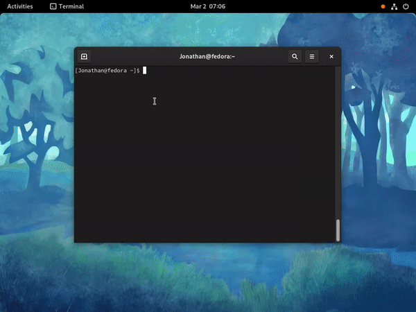

A search provider for GNOME Shell that adds support for searching in:

* zx2c4/[pass](https://www.passwordstore.org/)
* compatible alternatives such as [gopass](https://www.gopass.pw/)
* or the [rbw](https://github.com/doy/rbw) Bitwarden/Vaultwarden client

Names of entries will show up in GNOME Shell searches, choosing one will copy the corresponding content to the clipboard.

Supports:

* using the [GPaste](https://github.com/Keruspe/GPaste) clipboard manager
* OTP with the [pass-otp](https://github.com/tadfisher/pass-otp) extension
* fields (cf below for syntax)



# Installation
[](https://repology.org/project/gnome-pass-search-provider/versions)

## Arch Linux
Install `gnome-pass-search-provider-git` from the AUR.

## Debian, Ubuntu and derivatives
If a package is available for your distribution version (see above for packaging status), just install `gnome-pass-search-provider` through APT:

```
apt install gnome-pass-search-provider
```

## Fedora

[](https://copr.fedorainfracloud.org/coprs/jle64/gnome-pass-search-provider/package/gnome-pass-search-provider/)

Enable the copr repo and install the package with DNF:

```
dnf copr enable jle64/gnome-pass-search-provider
dnf install gnome-pass-search-provider
```

## Manual

Ensure that python>=3.7 as well as the dbus, gobject and thefuzz (formerly fuzzywuzzy, might still be packaged under that name in your distribution) Python modules are installed. They should all be packaged under python-name or python3-name depending on your distribution.

Clone this repository and run the installation script as root:
```
git clone https://github.com/jle64/gnome-pass-search-provider.git
cd gnome-pass-search-provider
sudo ./install.sh
```

# Post-installation

Log out and reopen your GNOME session.

The search provider will be loaded automatically when doing a search.

You should see it enabled in GNOME Settings, in the Search pane. This is also where you can move it up or down in the list of results relatively to other search providers.

# Advanced usage

## OTP

The [pass-otp](https://github.com/tadfisher/pass-otp) extension is supported. Searches starting with `otp` will copy the otp token to the clipboard.

## Fields

To copy other values than the password in the first line from a pass file, start the search with `:NAME search...`. The field name must be a full but case insensitive match. This requires `GPaste`.

For example with a pass file like:
```
SUPERSECRETPASSWORD
user: username
pin: 123456
```

To copy the pin start the search with `:pin` and for the username with `:user`.

# Alternative password providers

## Gopass and other pass-compatible tools

If you want to use [gopass](https://www.gopass.pw/) or another `pass` compatible tool instead of `pass`, you need to set the proper environment variables to point to the executable and password store directory to use.

For example, on a systemd-based OS, you can run `systemctl --user edit org.gnome.Pass.SearchProvider.service` and add in the file:

```
[Service]
Environment=PASSWORD_EXECUTABLE=gopass
Environment=PASSWORD_STORE_DIR=/home/jonathan/.local/share/gopass/stores/root
```
(be careful not leave a trailing "/" at the end of the `PASSWORD_STORE_DIR` path)

Then save and restart the service with `systemctl --user restart org.gnome.Pass.SearchProvider.service`.

On other systems, you might want to use `~/.profile` or another mechanism to set these environment variables.

## Bitwarden/Vaultwarden

To search in Bitwarden/Vaultwarden instead of `pass`, you will need to setup [rbw](https://github.com/doy/rbw). You'll also need to install `wl-clipboard` or another clipboard utility (such as `xclip`), unless you use GPaste.

You need to set the proper environment variables to point to the executables and specify to operate in Bitwarden mode.

For example, on a systemd-based OS, you can run `systemctl --user edit org.gnome.Pass.SearchProvider.service` and add in the file:

```
[Service]
Environment=PASSWORD_EXECUTABLE=rbw
Environment=PASSWORD_MODE=bw
Environment=CLIPBOARD_EXECUTABLE=wl-copy
```
Then save and restart the service with `systemctl --user restart org.gnome.Pass.SearchProvider.service`.

On other systems, you might want to use `~/.profile` or another mechanism to set these environment variables.

# Clipboard managers

By default, passwords are sent to the clipboard using `pass -c`, which defaults to expiration after 45 seconds.

If [GPaste](https://github.com/Keruspe/GPaste) is installed, passwords be sent to it marked as passwords through its API, thus ensuring they are not visible in the UI.

# Compatibility

This implements the `org.gnome.Shell.SearchProvider2` D-Bus API and has been tested with GNOME Shell 3.22 to 42. This uses the `org.gnome.GPaste1` or `org.gnome.GPaste2` versions of the GPaste D-Bus API to add passwords to GPaste.

# Troubleshooting

## Environment variables have no effect

If you are configuring `pass` through environment variables, such as `PASSWORD_STORE_DIR`, make sure to set them in a way that will propagate to the search provider executable, not just in your shell.

Setting them in `~/.profile` should be sufficient, but keep in mind that stuff in shell-specific files such as `~/.bashrc` only affects the command-line shell and will not propagate to the script. On systemd-based OSes, you can also directly set them in `~/.config/environment.d/*.conf` (see `man environment.d`).

If your values have no effect, make sure they propagate to the script environment. You can check this by displaying the process environment with `ps` and looking for your values here:
```
ps auxeww | grep [g]nome-pass-search-provider.py
```

## Passphrase is not requested to unlock store

If you don't see passphrase prompts when your key is locked, it might be because GPG is not using the right pinentry program. You can force gpg-agent to use pinentry-gnome3 by adding `pinentry-program /usr/bin/pinentry-gnome3` to `~/.gnupg/gpg-agent.conf`.

## Other problems

If you encounter problems, make sure to look in the logs of GNOME and D-Bus. On systems that use systemd, you can do this using `journalctl --user`.

Don't hesitate to open an issue.
